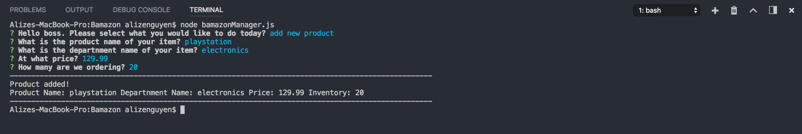

# Bamazon

## Overview

Bamazon is an Amazon-like storefront using Node.js and MySQL. The bamazonCustomer application takes in orders from customers and depletes the correlating inventory. The bamazonManager tracks inventory, add inventory, as well as new products.

## Bamazon - Customer 

The customer side of the app runs by: 

* Populating a table with each product's item id, product name, and product price.

* The user will then me prompted with what item he or she wants by item id and the quantity he or she would like to purchase.

* If the store does not have enough of the item in stock, the message "Insufficient Quantity" will come up. 

* If the store has a sufficient amount, the transaction will occur while updating the SQL database with the remaining quantity. The total price, a thank you message, and the remaining stock of that particular item will then be displayed.  

## Bamazon - Manager

